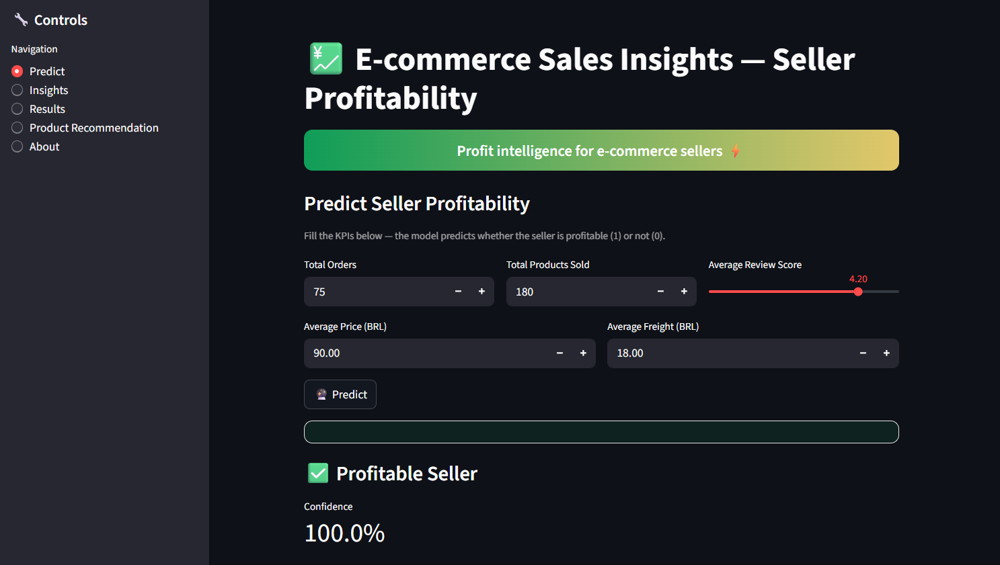
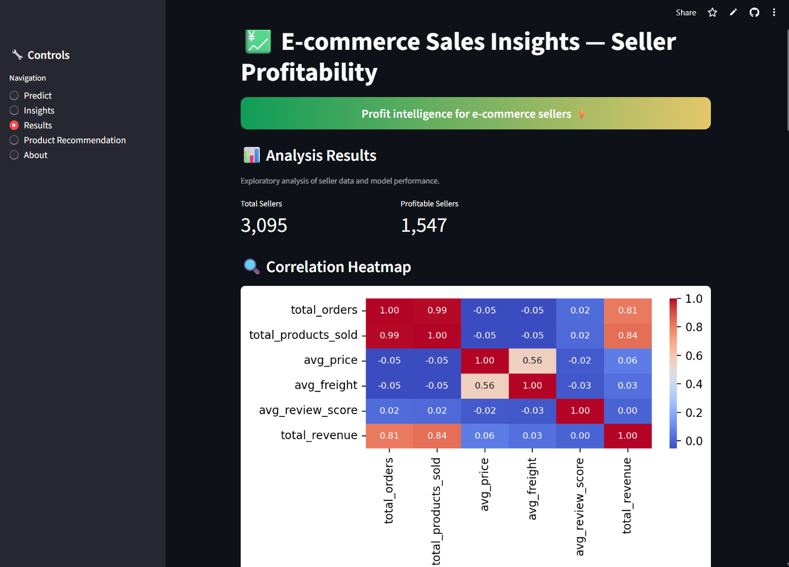
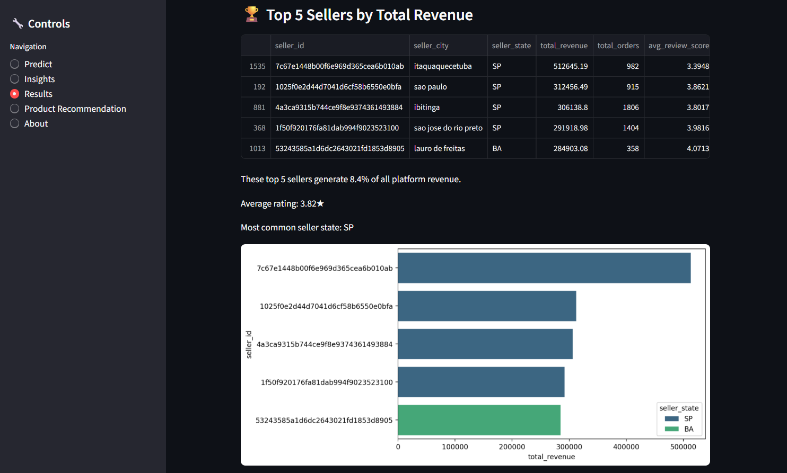
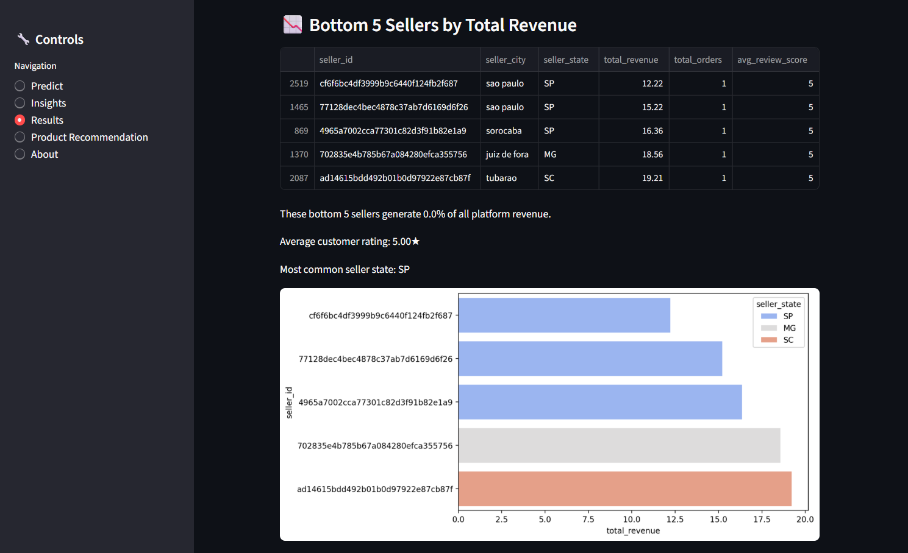
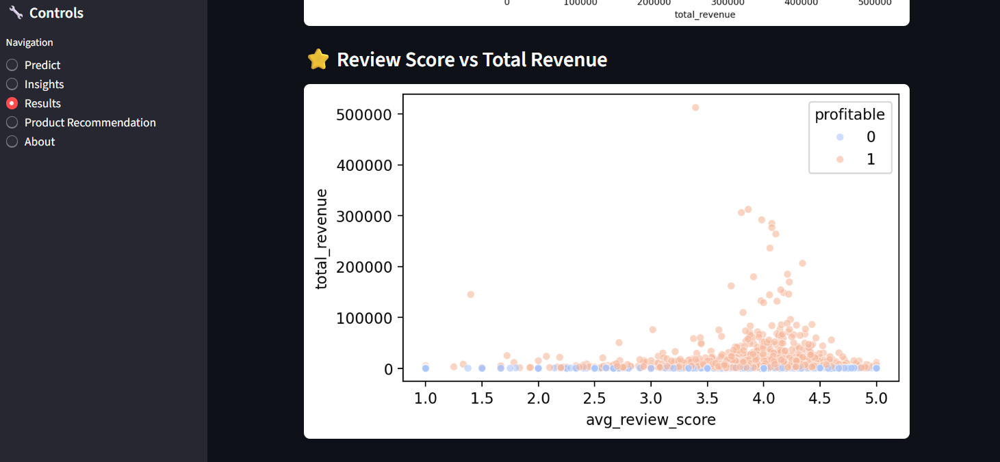
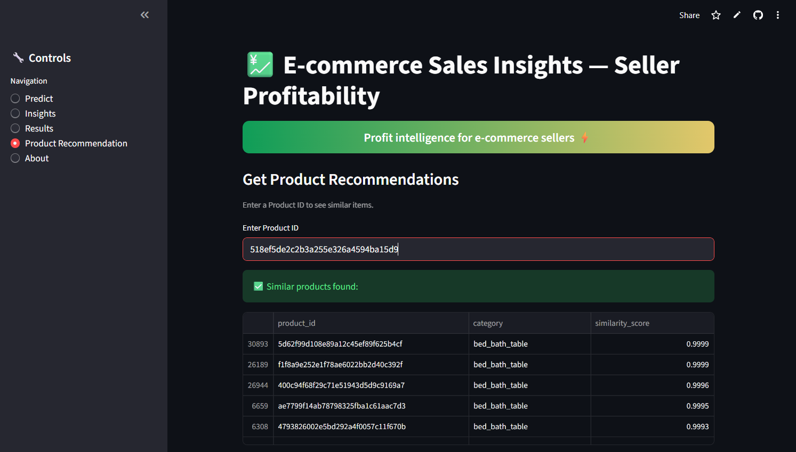

<div align="center">

# 💹 E-COMMERCE SALES INSIGHTS


<br>

🚀 **Live Demo:** [E-commerce Sales Insights App](https://ecommercesalesinsights-yg5y5vb6hnmdswappppyddcg.streamlit.app/)
📊 Explore data • Predict profitability • Recommend products

</div>

---

## 🧠 Overview

**E-commerce Sales Insights** is a data-driven project designed to analyze and predict the profitability of sellers on the **Brazilian Olist platform**.
It combines **Machine Learning**, **Business Intelligence**, and **Interactive Dashboards** to uncover insights about seller performance, customer satisfaction, and revenue growth.

🎯 What does this project offer?

- ✅ **Identifying Profitable Sellers** from the existing pool to prioritize support and partnerships.
- ✅ **Discovering Success Patterns** among top-performing sellers to guide others.
- ✅ **Enhancing Customer Experience** through a smart product recommendation system.
- ✅ **Making Data-Driven Decisions** instead of relying on guesswork.

---

## ✨ Key Features

- 📈 **Profitability Prediction** — Determines whether a seller is profitable using sales KPIs
- 🧮 **Data Visualization** — Interactive insights: heatmaps, bar charts, and correlation plots
- 🛒 **Product Recommender** — Suggests similar products based on price & freight value
- ⚙️ **Automated Pipeline** — From training → visualization → deployment
- 💻 **Streamlit UI** — Fully interactive and accessible web interface

---

## 🧩 Tech Stack

| Category | Technologies |
|-----------|---------------|
| **Language** | Python 3.9+ |
| **Framework** | Streamlit |
| **Data Analysis** | Pandas, NumPy |
| **Visualization** | Seaborn, Matplotlib |
| **Machine Learning** | Scikit-learn (RandomForest, KNN) |
| **Explainability** | SHAP |
| **Deployment** | Streamlit Cloud / Ngrok |

---

## 📂 Project Structure

```bash
E_commerce_Sales_Insights/
│
├── app.py                           # Streamlit dashboard & user interface
├── train_model.py                   # Data preparation & Random Forest training
├── recommendation_system.py         # Product recommendation engine (KNN)
├── cleaned_seller_data.csv          # Processed seller dataset
├── seller_profitability_model_simple.pkl  # Trained ML model
├── E_COMMERCE__SALES__INSIGHTS_FAI.ipynb  # Exploratory notebook
└── README.md                        # Project documentation
```

---

## ⚙️ How to Run

```bash
# 1️⃣ Clone the repository
git clone https://github.com/ifai2/E_commerce_Sales_Insights.git
cd E_commerce_Sales_Insights

# 2️⃣ Install dependencies
pip install -r requirements.txt

# 3️⃣ Run the product recommender (optional)
python recommendation_system.py

# 4️⃣ Train the model
python train_model.py

# 5️⃣ Launch the dashboard
streamlit run app.py
```
🧩 Try it yourself!
You can test the recommender using this sample Product ID:
#### 518ef5de2c2b3a255e326a4594ba15d9
---

## 🎥 Demo Preview

Below are some screenshots from the live Streamlit app 👇

### 🔍 Seller Profitability Prediction page



- An input interface for a predictive model. Users enter key seller metrics to predict profitability.

- Input fields include: Total Orders, Total Products Sold, Average Review Score, Average Product Price
and Average Freight Value.

- The model outputs a binary prediction: "Profitable Seller" (1) or not (0).

- In this example, the prediction is "Profitable Seller" with 100% confidence.


### 🔍 Correlation Heatmap



- A correlation matrix (heatmap) showing the statistical relationships between different seller performance metrics.

- Values and colors indicate the strength and direction of correlation (from -1.0 to 1.0).

- The strongest positive correlation is between 'total_orders' and 'total_products_sold' (0.99).

- 'avg_review_score' shows almost no correlation with 'total_revenue' (0.00).


### 🏆 Top 5 Sellers by Total Revenue



- A table displaying the platform's top 5 sellers, ranked by their total revenue.

- Table columns include: Seller ID, City, State, Total Revenue, Total Orders, and Average Review Score.

- The most common state among top sellers is São Paulo (SP).


### 📉 Bottom 5 Sellers by Total Revenue



- A table displaying the platform's 5 lowest-performing sellers based on total revenue.

- Each seller has only one order and very low revenue.

- Despite their low sales, all five sellers have a perfect 5.0 average review score.


### 📊 Review Score vs. Revenue Relationship



- Scatter plot analysis revealing the weak correlation between customer ratings and seller revenue.

- Visualizes: The distribution of total revenue across all seller review scores

- Key Insight: No strong correlation exists between high ratings and high revenue

- Notable Finding: Many low-revenue sellers maintain perfect 5-star ratings

- Business Implication: Excellent ratings alone don't guarantee financial success; other factors drive profitability


### 🛒 Product Recommendations


- An interface where a user can enter a Product ID to find similar items.

- The system returns a list of the top 5 most similar products from the same category.

- Each recommendation includes a similarity score, with results showing very high similarity (over 99.9%).

- In this case, all recommended products belong to the 'bed_bath_table' category.


---

## 📊 Results & Insights


1. **Profitability Can Be Accurately Predicted**

- Our machine learning model successfully predicts seller profitability using key performance indicators like order volume, products sold, and pricing.

- It provides high-confidence predictions, enabling data-driven decisions to support sellers.

2. **High Ratings Don't Guarantee High Revenue**

- The analysis reveals a critical insight: there is no strong correlation between high customer review scores and high sales revenue.

- Many top-performing sellers have moderate ratings (3.0–4.0), indicating that factors other than reviews are primary drivers of success.

3. **Sales Volume is the Key Driver**

- A very strong correlation (0.99) exists between 'Total Orders' and 'Total Products Sold,' suggesting customers often purchase multiple items.

- This highlights the importance of strategies that increase order volume and average order size.

4. **Smart Recommendations Enhance Sales**

- The product recommendation engine effectively identifies similar items with exceptional accuracy (>99.9%).

- This functionality directly enables cross-selling and personalization to boost sales and customer engagement.

5.  **Key Business Implications**
* For Sellers: Focus on increasing sales volume and product diversity rather than solely pursuing perfect 5-star ratings.

* For Platform Managers: Use the profitability model for early identification of at-risk sellers to provide targeted support.

* For Growth: Leverage the recommendation system to increase average order value and improve the customer shopping experience.
